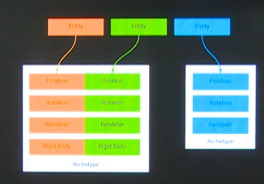

# Unity_ECS_HelloWorld
## Unity_ECS提升游戏的运行效率

## DOTS
DATA-ORIENTED TECH STACK(多线程数据导向型技术堆栈)

##### 核心-高性能
充分利用多核处理器，多线程处理让游戏的运行速度更快，更高效。

##### 组成
* C#任务系统(Job System)，用于高效运行多线程代码
* 实体组件系统(ECS)，用于默认编写高性能代码
* Burst编译器，用于生成高度优化的本地代码

Job System和ECS是两个不同的概念，两者组合在一起才能发挥最大的优势。

## C#任务系统
* 在Job System对外之前，Unity虽然内部是多线程处理，但是外部代码必须泡在主线程上。
* C#虽然支持Thread，但是在Unity中只能处理数据，例如：网络消息、下载。如果想在Thread中调用Unity的API那是不行的。
* 有了Job System就可以充分利用CPU的多核，例如:在多线程中修改Transform旋转、缩放、平移。
* 例如:MMO游戏判断碰撞、大量的同步角色坐标、大量的血条飘字等都比较适合在Job System。
* Unity没有直接将Thread开放出来，可以有效避免Thread被滥用，开发者可放心使用Job而不用太多关心如线程安全、枷锁这些问题。
* Job最好配合Burst编译器，这样能生成高效的本地代码

## HPC#
高性能C#
* .NET Core比C++慢2倍
* Mono比.NET Core慢3倍
* IL2CPP比Mono快2-3倍，IL2CPP与.NET Core效率相当，但是依然比C++慢2倍
* Unity使用Burst编译后可以让C#代码的运行效率比C++更快

##### 介绍
* C# 引用类型数据的内存分配在堆上，程序员无法主动释放，但必须等到.NET垃圾回收才可以真正清理。
* IL2CPP虽然将IL转成C++代码，实际上还是模拟了.NET的垃圾回收机制，所以效率并非等于Cpp
* HPC#就是NativeArray<T>可代替数组T[]数据类型包括值类型(float,int,uint,short,bool...),enums,structs和其他类型的指针
* NavtiveArray可以在C#层分配C++中的对象，可以主动释放不需要等C#的垃圾回收
* Job System中使用的就是NavtiveArray

##### 验证


上图代码和内存图可见，创建NativeArray在堆内存上永远只有32B，而我们手动创建的数组就12.2KB的堆内存，差别还是很明显的。

## 添加组件
* Entities
* Mathematics
* Hybrid Renderer
* Jobs

## 效果图对比
1.用ECS创建10000个cube移动和传统方式创建10000cube移动帧率会有明显差异


2.利用Job System提高CPU的运算速度


可以看出利用JobSystem计算速度提升了10倍左右

再利用Burst更惊人，直接变成了0.2毫秒


性能提高了3000倍

3.在一组例子


能看出明显的帧率的变化

## 执行顺序
#### 参考文档
https://connect.unity.com/p/unity-ecs-wu-liao-jie-systemzhi-xing-shun-xu

#### 三个基本的ComponentSystemGroup


* InitializationSystemGroup 负责初始化工作
* SimulationSystemGroup  负责逻辑运算工作
* PresentationSystemGroup 负责结果与图形渲染工作

#### 排序原则
* 根据其[UpdateBefore/After(typeof(MySystem))]属性。如果在进行排序时在同一组中找不到属于此属性的系统类型，则它无效，并且会向您发送警告。
* 如果没有[UpdateBefore/After]，它将会尝试分配到合适的位置，但仍确保那些具有[UpdateBefore/After]属性的System顺序不会改动。
* 如果该ComponentSystemGroup包含另一个ComponentSystemGroup，则将对其进行递归排序。
* 它可以检测到您的循环依赖关系[UpdateBefore/After]并记录信息。

#### 添加标签改变执行顺序
```
[UpdateInGroup(typeof(InitializationSystemGroup))]
public class SequenceSystemA : ComponentSystem
{
    protected override void OnUpdate()
    {
       Debug.Log("SequenceSystemA Updating");
    }
}
```

```
[UpdateInGroup(typeof(SimulationSystemGroup))]
public class SequenceSystemB : ComponentSystem
{
    protected override void OnUpdate()
    {
        Debug.Log("SequenceSystemB Updating");
    }
}
```


更改标签
```
[UpdateInGroup(typeof(SimulationSystemGroup))]
[UpdateAfter(typeof(SequenceSystemB))]
public class SequenceSystemA : ComponentSystem
{
    protected override void OnUpdate()
    {
       Debug.Log("SequenceSystemA Updating");
    }
}
```

```
[UpdateInGroup(typeof(SimulationSystemGroup))]
public class SequenceSystemB : ComponentSystem
{
    protected override void OnUpdate()
    {
        Debug.Log("SequenceSystemB Updating");
    }
}
```


## C#任务系统
* Job中数据类型只能是值类型
* Job中不能使用引用类型，T[]数组属于引用类型，所以无法在job中使用
* Job中使用NativeArray<T>代替T[]


启动1000个Job

发现各个工作线程并不是同时执行的，但有个好处是确保数据是正确的。

## IJobParallelFor(Job并行执行)
* IJOB是一个一个的开县城任务，因为数据是顺序执行的所以他可以确保数据正确性。
* 如果想让线程任务真正的并行，那么可以采用IJobParallelFor
* 一旦线程任务并行的话，就意味着数据的执行下顺序不是线性的，每一个Job里的数据不能完全依赖上一个Job执行后的结果。
* [ReadOnly]声明数据是否制度，如果数据是只读的，意味着这个数据不需要加锁。
* 如果不声明默认数据是Read/Write的，数据一旦需要修改，那么Job就一定要等它。
* 然而这一切Unity都已经帮我们做好，不需要自己做加解锁逻辑。


可以看出完全并行执行了。

## Burst编译器原理
* Burst编译器是以LLVM为记住的后端编译技术
* 编译器的原理会分为5个步骤：源代码->前端->优化器->后端->机器码
* LLVM的定义了个抽象语言IR，前端负责将源码C#编译成IR，优化器负责优化IR，后端负责将IR生成目标语言这里就是机器码
* 正是因为抽象语言IR的存在，所以LLVM支持的语言很多，而且也方便扩展C#、ActionScript、OC、Python、Swift等语言。
* LLVM代码是开源了，所以Unity很适合用它来做Burst的编译。
* 遗憾的是LLVM对C#的GC做的不好，所以Burst只支持值类型的数据编译，不支持引用类型的数据编译。

## Unity.Mathematics数学库
* Unity.Mathematics提供了矢量类型(float4,flaot3),它可以直接银蛇到硬件SIMD寄存器。
* Unity.mathematics的Math类中也提供了直接银蛇到硬件SIMD寄存器。
* 这样原本CPU需要一个个计算的，有了SIMD可以一次性计算完毕。
* 需要注意的是Unity之前的Math类默认是不支持映射SIMD寄存器的。


## 启动BurstCompile
在Struct上添加上BurstCompile标签，Struct必须继承IJob类，否则无效。

## Component组件
* 组件是一个简单的数据存储，它是struct值类型，并且实现IComponentData接口，它不能写方法，没有任何行为，比如前面提到的Position或者Rotation。
* struct中建议使用float3代替Vector3、quaternion代替Quaternion，原因就是我们之前提到了Unity重写的数学库。
* Unity.Mathematics的math类中也提供了直接映射到硬件SIMD寄存器。


相同类型的组件会连续排布，提高cache命中率。

## Archetype原型

* 遍历组件之所以特别高效，得益于Archetype原型。
* Archetype是一个容器，并且Unity规定每一个Archetype的大小是16kb，不够就再开一个，始终保持内存的连续性。
* 如果我们在同一帧创建了100个实体，每个实体都有Position和Rotation组件，因为他们都用了相同的ArcheType所以他们在内存中都是连续的。

## System系统
* System系统只关心Component组件，并不关心Component到底属于哪个Entity。
* System系统中定义它所关心的组件，组件都连续的保存在ArcheType中，所以查找速度非常快。
* System系统中在Update里可以统一更新自己关心的组件。


## ISharedComponentData共享组件
* IComponentData是结构体，结构体本身就是值类型数据，如果大量结构体中保存到 数据完全相同，那么在内存中也会产生多份。
* ISharedComponentData表示共享组件，比较典型的例子就是场景中可能有很多物体渲染时的mesh和材质是相同的，如果使用IcomponentData来保存这就是内存的白白浪费。ISharedComponentData组件需要实现IEquateble<MyComponent>接口，用于判断两个组件是否相等。


## World世界
* World包含EntityManager(实体管理器)、ComponentSystem(组件系统)、ArcheTypes(原型)
* 注意EntityManager包含的是这个世界里所有的Entity、ComponentSystem则包含世界里所有的组件、ArcheTypes包含世界里所有的原型。
* ECS默认提供了一个世界，我们也可以自己创建多个世界。
* 世界与世界之间不具备互通性，每个世界都是唯一的，多个世界则可以同时并行。
* World world = new World("MyWorld");可以new一个新的世界。


## ECS+JOB+BURST让性能飞起来
* ECS里的Component已经具有超高的Cache命中率，性能已经比传统的脚本方式快了不少。
* 但是ComponentSystem知识运行在主线程中。
* 这就意味着每个ComponentSystem都必须等上一个执行完毕才能执行自己的。
* ECS要配合JobSystem才能让性能飞起来。


## JobComponentSystem
* JobComponentSystem继承ComponentSystem。
* JobCompoonentSystem的Update和ComponentSystem一样都是一个执行完毕再执行喜爱一个。
* 区别是JobComponentSystem的Update可以很快就返回，将复杂的计算丢给Job去完成。
* 通过[ReadOnly]标志job中的数据是否为只读，只读的话Job是可以完全并行的。
* 如果Job中某一个数据发声修改，那么这块数据就不能访问这块数据其他的Job并行运行。

## DOTS实践-删除游戏对象
* 给一个空的GameObject绑定渲染组件和旋转组件。
* 以前需要给GameObject板顶MeshFilter和MeshRender组件，现在都不需要了。
* 使用ComponentDataProxy可以把一个struct绑定在游戏对象上。


## 彻底删除游戏对象
* Hierachy中现在仅有一个空的游戏对象，通过proxy将渲染、渲染组件绑定。
* 进一步优化，把这个空游戏对象也彻底从Hierarchy视图中删除。


## 场景导出ECS

点击新生成的脚本中的Close按钮

## Prefab导出ECS
保存Prefab，通过GameObjectConversionUtility.ConvertGameObjectHierarchy直接将Prefab加载成ECS对象，注意Prefab只能是普通Mesh，如果带有谷歌动画是不能转成ECS的。
```
var manager = World.Active.EntityManager;
Entity entity = GameObejctConversionUtility.ConvertGameObjectHierarchy(prefab,World.Active);
Entity go = manager.Instantiate(entity);
```

## ECS渲染
* ECS本身是不包含渲染的，但是游戏的渲染其实跟实体Entity是紧密绑定的。
* 原理大致是通过ECS在JOB中先准备渲染的数据，然后通过GPU Instancing一次渲染，中间不产生GameObject。
* GPU Instancing是不待裁剪的，并且需要每帧在Update里调用，这样会产生额外的开销，即使物体不发生位置或者属性变化都需要强制刷新。
* 建议使用CommandBuffer来渲染GPU Instancing，这样只有当物体位置或者属性发声改变再新型
* 强制刷新。
